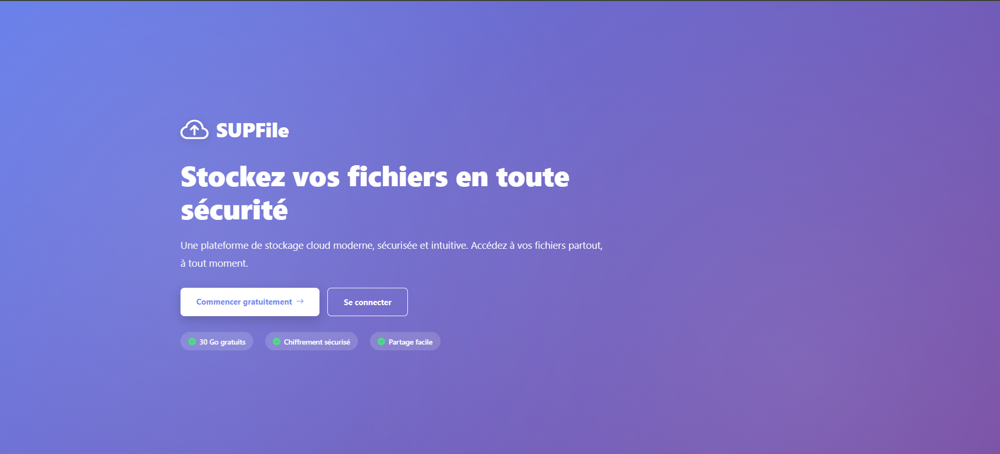
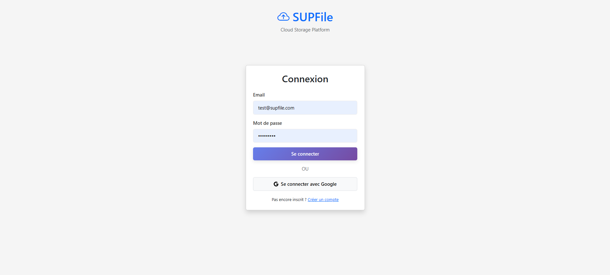
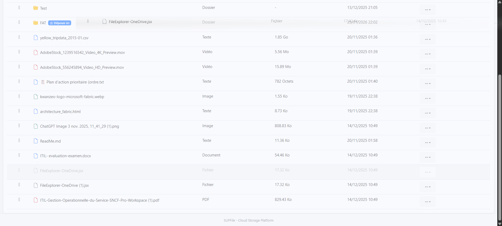
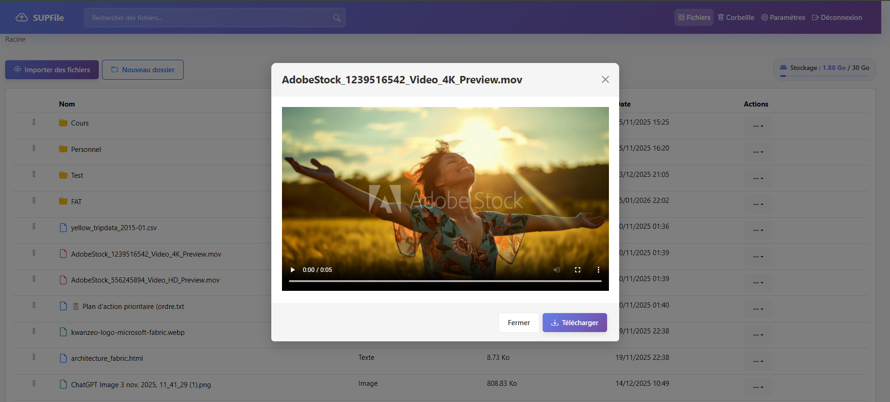
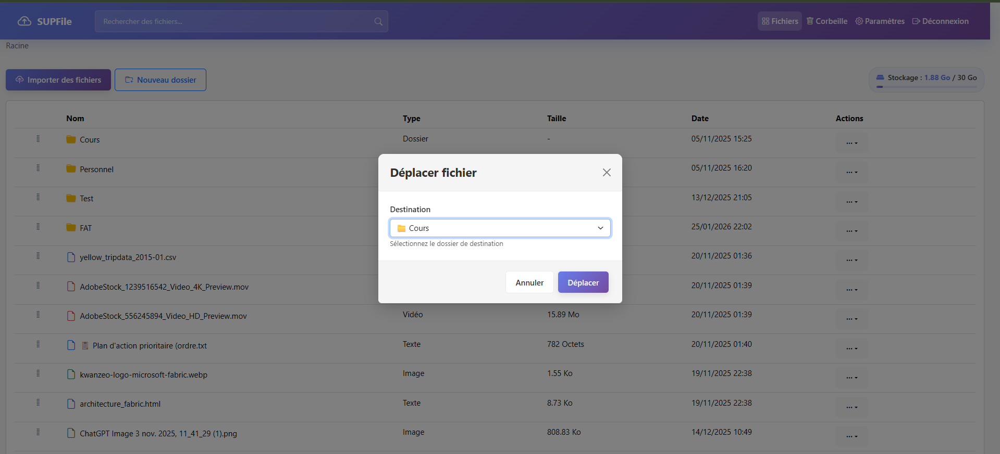
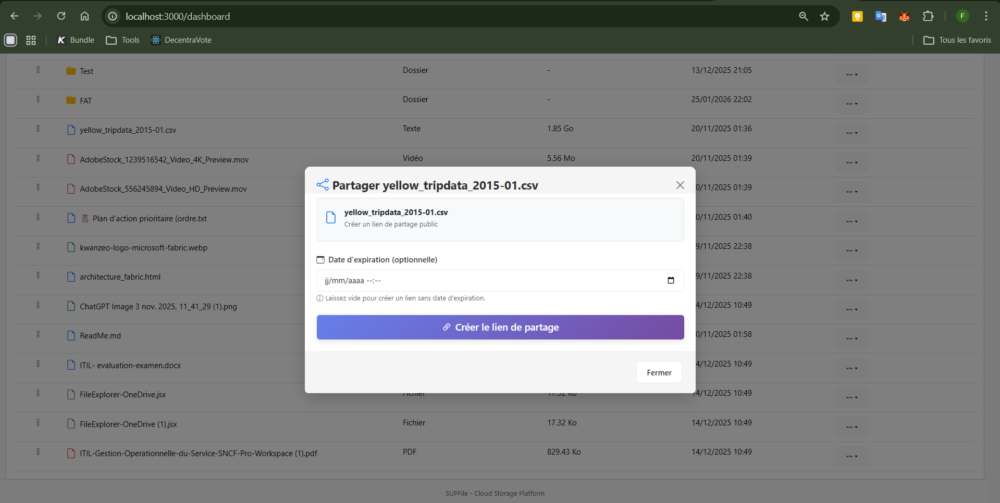
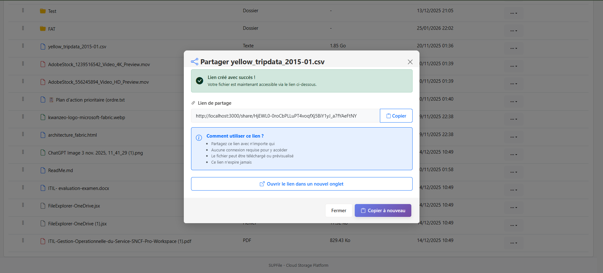
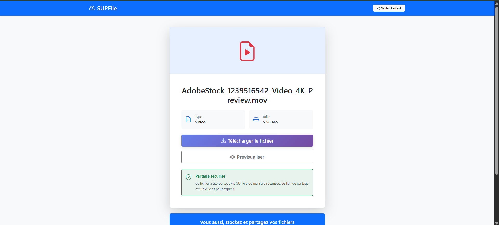
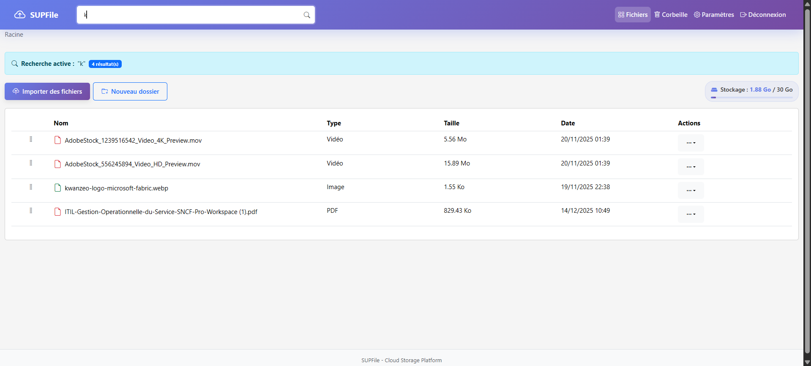

# MANUEL UTILISATEUR - SUPFile

**Application** : SUPFile - Plateforme de stockage cloud  
**Version** : 1.0.0  
**Date** : 31 janvier 2026

---

## Table des matières

1. [Introduction](#1-introduction)
2. [Premiers pas](#2-premiers-pas)
3. [Gestion des fichiers](#3-gestion-des-fichiers)
4. [Gestion des dossiers](#4-gestion-des-dossiers)
5. [Partage de fichiers](#5-partage-de-fichiers)
6. [Recherche](#6-recherche)
7. [Corbeille](#7-corbeille)
8. [Paramètres du compte](#8-paramètres-du-compte)
9. [FAQ](#9-faq)

---

## 1. Introduction

### 1.1 Qu'est-ce que SUPFile ?

SUPFile est une plateforme de stockage cloud sécurisée qui vous permet de :

- **Stocker vos fichiers** en toute sécurité dans le cloud
- **Organiser** vos fichiers dans une arborescence de dossiers
- **Partager** vos fichiers via des liens publics
- **Accéder** à vos fichiers depuis n'importe quel navigateur
- **Prévisualiser** vos images, vidéos, PDFs et documents texte
- **Gérer** un quota de 30 Go d'espace de stockage gratuit


---

### 1.2 Configuration requise

**Navigateurs supportés :**
- Google Chrome (recommandé)
- Microsoft Edge
- Mozilla Firefox
- Safari

**Connexion internet :**
- Connexion haut débit recommandée pour l'upload de fichiers volumineux

---

## 2. Premiers pas

### 2.1 Créer un compte

#### **Option 1 : Inscription classique**

1. Accédez à l'application : **http://localhost:3000**
2. Cliquez sur **"Créer un compte"**
3. Remplissez le formulaire :
   - **Email** : Votre adresse email
   - **Nom complet** : Votre nom (optionnel)
   - **Mot de passe** : Au moins 8 caractères
   - **Confirmer le mot de passe**
4. Cliquez sur **"Créer un compte"**
5. Vous êtes automatiquement connecté !


---

#### **Option 2 : Connexion avec Google**

1. Sur la page d'inscription, cliquez sur **"Se connecter avec Google"**
2. Choisissez votre compte Google
3. Autorisez SUPFile à accéder à votre email
4. Vous êtes connecté !

**Avantages :**
- Pas de mot de passe à retenir
- Connexion ultra-rapide
- Sécurité renforcée par Google

---

### 2.2 Se connecter


1. Accédez à **http://localhost:3000**
2. Cliquez sur **"Se connecter"**
3. Saisissez votre **email** et **mot de passe**
4. Cliquez sur **"Se connecter"**

**OU** utilisez le bouton **"Se connecter avec Google"**

---

### 2.3 Interface principale

Une fois connecté, vous arrivez sur le **tableau de bord** :

```
┌────────────────────────────────────────────────────────────────┐
│  SUPFile    [Fichiers] [Corbeille] [Paramètres] [Déconnexion] │
├────────────────────────────────────────────────────────────────┤
│                                                                 │
│  [Rechercher des fichiers...]          [Stockage: 2.5 Go / 30 Go] │
│                                                                 │
│  [Importer des fichiers]  [Nouveau dossier]                    │
│                                                                 │
│  Racine                                                         │
│  ┌──────────────────────────────────────────────────────────┐ │
│  │ Nom             Type       Taille      Date      Actions │ │
│  ├──────────────────────────────────────────────────────────┤ │
│  │ Documents       Dossier    -           01/01/26  [...]  │ │
│  │ Photos          Dossier    -           15/01/26  [...]  │ │
│  │ Rapport.pdf     PDF        2.5 Mo      20/01/26  [...]  │ │
│  └──────────────────────────────────────────────────────────┘ │
└────────────────────────────────────────────────────────────────┘
```

**Éléments clés :**

1. **Barre de navigation** : Accès rapide aux sections
2. **Barre de recherche** : Rechercher vos fichiers
3. **Indicateur de stockage** : Espace utilisé / quota total
4. **Boutons d'action** : Importer fichiers, créer dossier
5. **Fil d'Ariane** : Navigation dans l'arborescence
6. **Liste des fichiers** : Vos fichiers et dossiers

---

## 3. Gestion des fichiers

### 3.1 Importer des fichiers

#### **Méthode 1 : Bouton "Importer"**

1. Cliquez sur "Importer des fichiers"
2. Une fenêtre s'ouvre avec deux options :
   - **"Sélectionner des fichiers"** : Parcourir votre ordinateur
   - **Zone de glisser-déposer** : Glissez vos fichiers directement
3. Sélectionnez un ou plusieurs fichiers
4. Cliquez sur **"Téléverser X fichier(s)"**
5. Une barre de progression s'affiche pour chaque fichier
6. Confirmation : "Fichier téléversé avec succès"

**Limites :**
- Taille maximale par fichier : **5 Go**
- Quota total : **30 Go**



---

#### **Méthode 2 : Glisser-déposer direct**

1. Ouvrez l'explorateur de fichiers de votre ordinateur
2. Sélectionnez un ou plusieurs fichiers
3. **Glissez-les** directement sur la zone de fichiers
4. Les fichiers sont automatiquement importés !

**Astuce :** Cette méthode est la plus rapide pour les uploads fréquents.

---

### 3.2 Prévisualiser un fichier

**Fichiers prévisualisables :**
- Images (JPG, PNG, GIF, WEBP)
- Vidéos (MP4, WEBM)
- PDF
- Fichiers texte (TXT, Markdown)

**Comment faire :**

1. **Cliquez** sur le nom du fichier
2. Une fenêtre de prévisualisation s'ouvre
3. Actions disponibles :
   - **Télécharger** : Sauvegarder sur votre ordinateur
   - **Fermer** : Retour à la liste


---

### 3.3 Télécharger un fichier

**Option 1 : Depuis le menu Actions**

1. Cliquez sur **[...]** à droite du fichier
2. Sélectionnez **"Télécharger"**
3. Le fichier est téléchargé dans votre dossier "Téléchargements"

**Option 2 : Depuis la prévisualisation**

1. Ouvrez la prévisualisation du fichier
2. Cliquez sur **"Télécharger"**

---

### 3.4 Renommer un fichier

1. Cliquez sur **[...]** à droite du fichier
2. Sélectionnez **"Renommer"**
3. Une fenêtre s'ouvre
4. Saisissez le **nouveau nom**
5. Cliquez sur **"Renommer"**
6. Le fichier est renommé instantanément

**Restrictions :**
- Maximum 255 caractères
- Caractères interdits : `< > : " / \ | ? *`

---

### 3.5 Déplacer un fichier

#### **Méthode 1 : Glisser-déposer**

1. **Cliquez et maintenez** sur le fichier
2. **Glissez-le** sur le dossier de destination
3. Un badge **"Déposer ici"** apparaît
4. **Relâchez** le fichier
5. Notification : "Fichier déplacé vers [Dossier]"


---

#### **Méthode 2 : Menu Actions**

1. Cliquez sur **[...]** à droite du fichier
2. Sélectionnez **"Déplacer"**
3. Une fenêtre s'ouvre avec la liste des dossiers
4. Sélectionnez le **dossier de destination**
5. Cliquez sur **"Déplacer"**

---

### 3.6 Supprimer un fichier

1. Cliquez sur **[...]** à droite du fichier
2. Sélectionnez **"Supprimer"**
3. Une confirmation apparaît
4. Cliquez sur **"Supprimer"**
5. Le fichier est déplacé dans la **corbeille**

**Important :**
- Les fichiers supprimés vont dans la corbeille
- Ils peuvent être **restaurés** à tout moment
- Pour supprimer définitivement : voir section [Corbeille](#7-corbeille)

---

## 4. Gestion des dossiers

### 4.1 Créer un dossier

1. Cliquez sur "Nouveau dossier"
2. Une fenêtre s'ouvre
3. Saisissez le **nom du dossier**
4. Cliquez sur **"Créer"**
5. Le dossier apparaît dans la liste

**Astuce :** Vous pouvez créer des **sous-dossiers** en ouvrant un dossier puis en cliquant à nouveau sur "Nouveau dossier".

---

### 4.2 Naviguer dans les dossiers

**Méthode 1 : Clic sur le dossier**

1. **Cliquez** sur le nom du dossier
2. Vous entrez dans le dossier
3. Le **fil d'Ariane** affiche votre position : `Racine > Documents > 2026`

**Méthode 2 : Fil d'Ariane**

1. Cliquez sur n'importe quel niveau du fil d'Ariane
2. Vous revenez directement à ce niveau

Exemple :
```
Racine > Documents > 2026
  |         |         |
Cliquez pour revenir à ce niveau
```

---

### 4.3 Renommer un dossier

1. Cliquez sur **[...]** à droite du dossier
2. Sélectionnez **"Renommer"**
3. Saisissez le nouveau nom
4. Cliquez sur **"Renommer"**

---

### 4.4 Déplacer un dossier

**Attention :** Déplacer un dossier déplace également **tout son contenu** (fichiers + sous-dossiers).

**Procédure :**

1. **Glissez-déposez** le dossier sur un autre dossier
   - OU -
2. Menu **[...]** > **"Déplacer"** > Sélectionner destination

**Restrictions :**
- Impossible de déplacer un dossier sur lui-même
- Impossible de déplacer un dossier dans l'un de ses sous-dossiers

---

### 4.5 Télécharger un dossier

1. Cliquez sur **[...]** à droite du dossier
2. Sélectionnez **"Télécharger (ZIP)"**
3. Le serveur génère une archive ZIP contenant :
   - Tous les fichiers du dossier
   - Tous les sous-dossiers et leur contenu
   - L'arborescence complète est préservée
4. Le fichier ZIP est téléchargé

**Exemple :**
```
Dossier "Projets" contient :
├── README.md
├── Images
│   ├── logo.png
│   └── banner.jpg
└── Documents
    └── rapport.pdf

Téléchargement : Projets.zip (arborescence intacte)
```

---

### 4.6 Supprimer un dossier

1. Cliquez sur **[...]** à droite du dossier
2. Sélectionnez **"Supprimer"**
3. **Avertissement** : "La suppression d'un dossier entraînera également la suppression de tous les fichiers et sous-dossiers qu'il contient."
4. Cliquez sur **"Supprimer"**
5. Le dossier et **tout son contenu** sont déplacés dans la corbeille

---

## 5. Partage de fichiers

### 5.1 Créer un lien de partage

1. Cliquez sur **[...]** à droite du fichier
2. Sélectionnez **"Partager"**
3. Une fenêtre s'ouvre
4. (Optionnel) Définissez une **date d'expiration**
5. Cliquez sur **"Créer le lien de partage"**
6. Le lien est généré !




---

### 5.2 Copier et envoyer le lien

Une fois le lien créé :

1. Le lien s'affiche dans un champ
2. Cliquez sur **"Copier"**
3. Notification : "Lien copié dans le presse-papiers !"
4. Collez le lien où vous voulez :
   - Email
   - Chat (WhatsApp, Telegram, etc.)
   - Réseaux sociaux

**Exemple de lien :**
```
http://localhost:3000/share/Xy9KpL2mNqW8rTfVhBcDsEaGjMnPzX4
```

---

### 5.3 Accéder à un fichier partagé

**Pour la personne qui reçoit le lien :**

1. Cliquez sur le lien reçu
2. Une page publique s'ouvre (pas besoin de compte !)
3. Informations affichées :
   - Nom du fichier
   - Taille
   - Type de fichier
4. Actions disponibles :
   - **"Télécharger le fichier"**
   - **"Prévisualiser"** (si compatible)



---

### 5.4 Gérer vos liens de partage

**Voir tous vos liens :**

1. Allez dans **"Paramètres"** > **"Connexions externes"**
   - OU -
2. Cliquez à nouveau sur **[...]** > **"Partager"** du fichier déjà partagé

**Supprimer un lien :**

1. Dans la liste de vos liens
2. Cliquez sur **"Supprimer"**
3. Le lien est désactivé (l'URL ne fonctionne plus)

---

### 5.5 Sécurité des liens

**Bonnes pratiques :**

- **Utilisez une date d'expiration** pour les fichiers sensibles
- **Partagez uniquement avec des personnes de confiance**
- **Supprimez les liens** dès que vous n'en avez plus besoin

**Caractéristiques de sécurité :**

- Lien unique et impossible à deviner (32 caractères aléatoires)
- Expiration automatique (si configurée)
- Possibilité de désactiver le lien à tout moment

---

## 6. Recherche

### 6.1 Rechercher un fichier

1. Utilisez la **barre de recherche** en haut de la page
2. Saisissez le **nom** (ou une partie du nom) du fichier
3. La recherche est **instantanée** !
4. Les résultats s'affichent automatiquement

**Exemple :**
```
Recherche : "rapport"

Résultats :
Rapport_2025.pdf
Rapport_financier.docx
Ancien_rapport.txt
```

---

### 6.2 Portée de la recherche

La recherche inclut :
- **Fichiers** dans le dossier actuel
- **Dossiers** dans le dossier actuel
- **Fichiers** dans tous les sous-dossiers

**Badge de résultats :**
Un badge affiche le nombre de résultats trouvés.



---

### 6.3 Annuler une recherche

1. Cliquez sur la **croix (×)** dans la barre de recherche
   - OU -
2. Effacez le texte et appuyez sur **Entrée**
3. Vous revenez à la vue normale

---

## 7. Corbeille

### 7.1 Accéder à la corbeille

1. Cliquez sur **"Corbeille"** dans la barre de navigation
2. La liste des fichiers/dossiers supprimés s'affiche

**Informations affichées :**
- Nom du fichier/dossier
- Type
- Taille
- Supprimé le

---

### 7.2 Restaurer un élément

1. Trouvez le fichier/dossier à restaurer
2. Cliquez sur **"Restaurer"**
3. L'élément est restauré à son **emplacement d'origine**

**Cas spéciaux :**
- Si le dossier parent a été supprimé : restauration à la **racine**
- Les sous-dossiers/fichiers sont restaurés avec le dossier parent

---

### 7.3 Supprimer définitivement

**ATTENTION : Cette action est IRRÉVERSIBLE !**

1. Cliquez sur **"Supprimer définitivement"**
2. Une confirmation apparaît
3. Cliquez sur **"Supprimer définitivement"**
4. Le fichier est **supprimé du serveur**
5. L'espace utilisé est **libéré**

---

### 7.4 Vider la corbeille

**ATTENTION : Supprime TOUS les fichiers de la corbeille !**

1. Cliquez sur **"Vider la corbeille"**
2. Une confirmation apparaît
3. Cliquez sur **"Vider la corbeille"**
4. Tous les fichiers sont supprimés définitivement

---

## 8. Paramètres du compte

### 8.1 Accéder aux paramètres

1. Cliquez sur **"Paramètres"** dans la barre de navigation
2. La page des paramètres s'ouvre

---

### 8.2 Modifier votre profil

**Informations modifiables :**

1. **Nom complet** :
   - Cliquez dans le champ "Nom complet"
   - Modifiez le nom
   - Cliquez sur **"Mettre à jour le profil"**

**Informations non modifiables :**
- Email (utilisé pour la connexion)

---

### 8.3 Changer de mot de passe

**Uniquement pour les comptes créés avec email/mot de passe** (pas OAuth).

1. Dans la section **"Mot de passe"**
2. Remplissez les champs :
   - **Mot de passe actuel**
   - **Nouveau mot de passe** (8 caractères minimum)
   - **Confirmer le mot de passe**
3. Cliquez sur **"Changer le mot de passe"**
4. Confirmation : "Mot de passe modifié avec succès"

---

### 8.4 Gérer les connexions OAuth

**Voir vos connexions :**

La section **"Connexions externes"** affiche :
- **Google** : Connecté

**Déconnecter Google :**

**Attention** : Vous devez avoir un mot de passe configuré avant de déconnecter OAuth !

1. Cliquez sur **"Déconnecter"** à côté de "Google"
2. Confirmation : "Déconnexion réussie"

**Reconnecter Google :**

1. Cliquez sur **"Connecter avec Google"**
2. Autorisez l'accès
3. Votre compte Google est reconnecté

---

### 8.5 Quota de stockage

**Voir votre quota :**

En haut à droite de l'interface principale :
```
Stockage : 2.5 Go / 30 Go
━━━━━━━━━━━━━━━━━━━━━━━
```

**Barre de progression :**
- Vert : < 75% utilisé
- Orange : 75-90% utilisé
- Rouge : > 90% utilisé

**Libérer de l'espace :**

1. Supprimez des fichiers inutiles
2. Videz la corbeille (suppression définitive)
3. Le quota se met à jour **instantanément**

---

## 9. FAQ

### Quel est mon quota de stockage ?

**30 Go** par utilisateur, gratuitement.

---

### Quelle est la taille maximale d'un fichier ?

**5 Go** par fichier.

---

### Mes fichiers sont-ils sécurisés ?

**Oui !**
- Mots de passe hashés (bcrypt)
- Connexion sécurisée (HTTPS en production)
- Fichiers stockés sur serveur sécurisé
- Authentification JWT

---

### Puis-je partager un dossier complet ?

Actuellement, seuls les **fichiers** peuvent être partagés.

**Solution de contournement :**
1. Téléchargez le dossier en ZIP
2. Re-uploadez le ZIP
3. Partagez le fichier ZIP

---

### Combien de temps les fichiers restent-ils dans la corbeille ?

**Indéfiniment**, jusqu'à ce que vous les supprimiez définitivement ou vidiez la corbeille.

---

### Puis-je récupérer un fichier supprimé définitivement ?

**Non**, la suppression définitive est **irréversible**.

**Conseil** : Faites toujours une **sauvegarde locale** de vos fichiers importants.

---

### Que se passe-t-il si je dépasse mon quota ?

Vous ne pourrez plus uploader de fichiers jusqu'à ce que vous libériez de l'espace.

**Actions possibles :**
1. Supprimer des fichiers
2. Vider la corbeille
3. Télécharger et supprimer des fichiers temporaires

---

### Puis-je utiliser SUPFile sur mobile ?

**Oui !** L'interface est **responsive** et s'adapte aux smartphones et tablettes.

---

### Mes fichiers sont-ils sauvegardés ?

En environnement de production, oui (sauvegardes automatiques).

**Recommandation** : Conservez toujours une **copie locale** de vos fichiers importants.


